# How MCS-OTEL Works

MCS-OTEL converts Microsoft Copilot Studio conversation transcripts into OpenTelemetry (OTEL) traces. Every step — parsing, entity extraction, enrichment, rule matching, and OTLP export — is driven by a single JSON config file. For setup instructions, see the [README](../README.md).

---

## 1. Primer: MCS Transcripts

Microsoft Copilot Studio records every conversation as a **transcript** — a JSON array of **activities**. Each activity represents something that happened: a user message, a bot response, or an internal trace event (knowledge search, plan execution, error, etc.).

Activities have a `type` field (`message`, `trace`, or `event`) and trace/event activities carry a `valueType` identifying the specific event kind (e.g., `DynamicPlanReceived`, `ErrorTraceData`). The `value` field contains the event's payload — often deeply nested JSON.

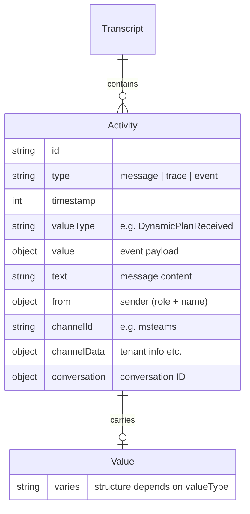

Key activity types in a typical transcript:

| type | valueType | Meaning |
|------|-----------|---------|
| `message` | — | User or bot message with `text` content |
| `trace` | `SessionInfo` | Session metadata: outcome, duration, turn count |
| `trace` | `ConversationInfo` | Locale, design mode flag |
| `event` | `DynamicPlanReceived` | AI orchestrator created an execution plan |
| `event` | `DynamicPlanStepTriggered` | A plan step started executing |
| `event` | `DynamicPlanStepFinished` | A plan step completed with results |
| `trace` | `DialogRedirect` | Topic/dialog routing change |
| `trace` | `ErrorTraceData` | Error with code and message |
| `trace` | `UniversalSearchToolTraceData` | Knowledge base search results |
| `trace` | `DynamicServerInitialize` | MCP server connection established |

---

## 2. Primer: OpenTelemetry Traces

OpenTelemetry represents work as **spans** arranged in a tree. Each span has a name, start/end time, key-value attributes, and optionally child spans and events. A **trace** is the root of that tree.

The OTLP JSON wire format nests spans inside scope and resource containers:

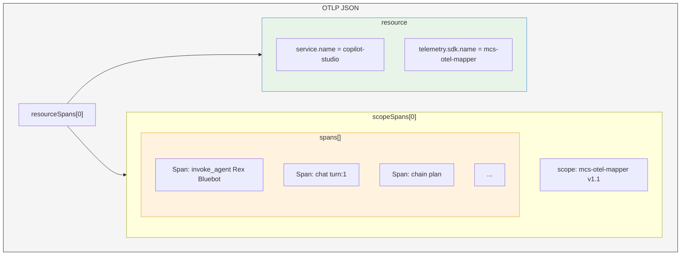

Each span carries:

| Field | Example |
|-------|---------|
| `traceId` | `a1b2c3d4...` (32 hex chars, shared across all spans) |
| `spanId` | `e5f6a7b8...` (16 hex chars, unique per span) |
| `parentSpanId` | Links child to parent |
| `name` | `"chat turn:1"` |
| `kind` | 1=INTERNAL, 2=SERVER, 3=CLIENT |
| `startTimeUnixNano` | Nanosecond precision timestamp |
| `endTimeUnixNano` | Nanosecond precision timestamp |
| `attributes[]` | `[{key: "gen_ai.agent.name", value: {stringValue: "Rex Bluebot"}}]` |
| `events[]` | Point-in-time annotations (errors, variable changes) |
| `status` | UNSET (0), OK (1), or ERROR (2) |

MCS-OTEL follows the [OpenTelemetry GenAI semantic conventions](https://opentelemetry.io/docs/specs/semconv/gen-ai/) for attribute naming — `gen_ai.operation.name`, `gen_ai.agent.name`, `gen_ai.tool.name`, etc.

---

## 3. High-Level Architecture

### Full Pipeline

```mermaid
flowchart LR
    Upload["Upload<br>JSON / CSV / YAML"]
    Parse["Parse<br>parsers.py"]
    Extract["Extract Entities<br>parsers.py"]
    Enrich["Enrich<br>parsers.py"]
    Map["Map to Spans<br>converter.py"]
    Export["OTLP JSON<br>converter.py"]
    Collector["Jaeger / Datadog<br>/ Azure Monitor"]

    Upload --> Parse --> Extract --> Enrich --> Map --> Export --> Collector

    style Upload fill:#4a90d9,color:white
    style Parse fill:#5ba85b,color:white
    style Extract fill:#5ba85b,color:white
    style Enrich fill:#5ba85b,color:white
    style Map fill:#e8a838,color:white
    style Export fill:#e8a838,color:white
    style Collector fill:#9b59b6,color:white
```

### Component Map

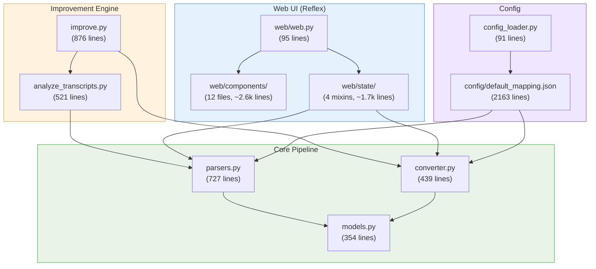

---

## 4. The Config System

`config/default_mapping.json` is the single source of truth. It drives parsing, enrichment, and mapping — no code changes needed to add support for new event types.

See: `config/default_mapping.json`, `config_loader.py`

### MappingSpecification Structure

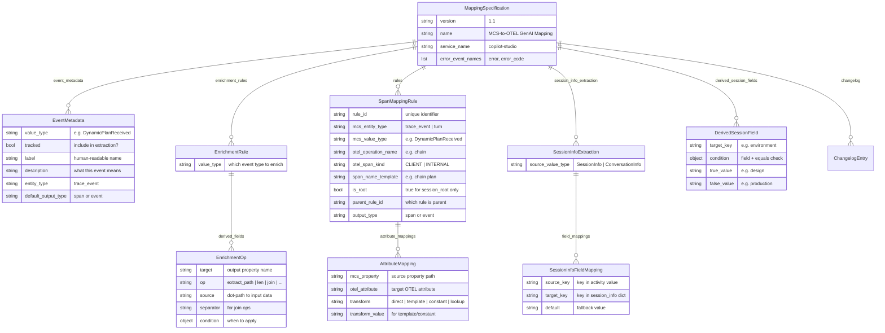

The 6 sections of the config, in processing order:

| Section | Count | Purpose |
|---------|-------|---------|
| `event_metadata` | 28 entries | Declares which valueTypes to track during entity extraction |
| `session_info_extraction` | 2 entries | Maps SessionInfo/ConversationInfo fields to session properties |
| `derived_session_fields` | 1 entry | Computes `environment` from `is_design_mode` |
| `enrichment_rules` | 16 entries | Flattens nested data into mappable properties per value type |
| `rules` | 28 entries | Maps entities to OTEL spans/events with attribute transforms |
| `changelog` | 1 entry | Version history |

### Config Loading Flow

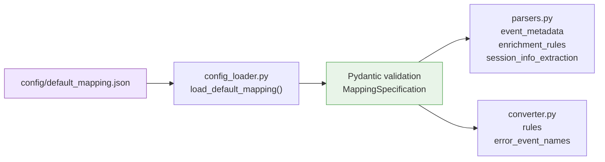

---

## 5. Worked Example: The Transcript

The examples throughout the rest of this document use the `rex_teams_transcript.json` test fixture — a simplified 1-turn conversation with "Rex Bluebot" on Microsoft Teams.

See: `tests/fixtures/rex_teams_transcript.json`

The conversation flow:

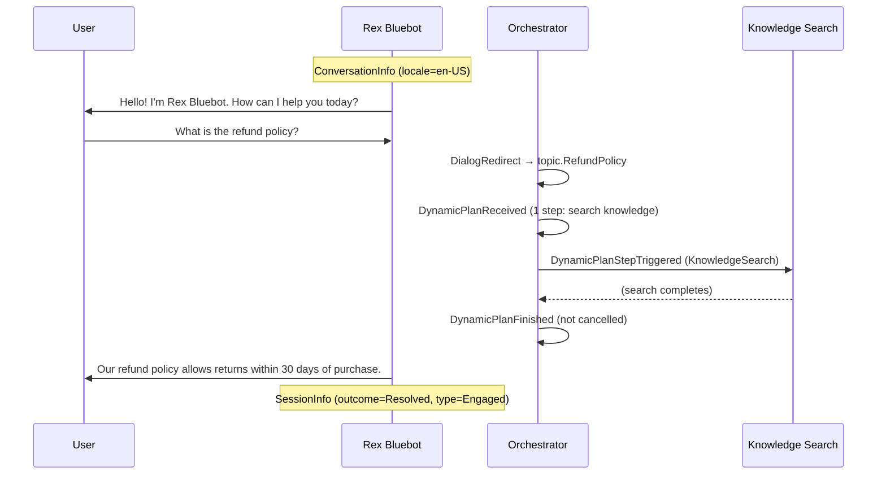

The raw transcript contains 9 activities:
1. `ConversationInfo` trace — locale, not design mode
2. Bot greeting message — "Hello! I'm Rex Bluebot..."
3. User message — "What is the refund policy?"
4. `DialogRedirect` trace — routing to topic.RefundPolicy
5. `DynamicPlanReceived` event — plan with 1 step
6. `DynamicPlanStepTriggered` event — knowledge search step
7. `DynamicPlanFinished` event — plan completed
8. Bot response message — "Our refund policy allows returns within 30 days..."
9. `SessionInfo` trace — outcome Resolved, 1 turn

---

## 6. Stage 1: Parsing + Entity Extraction

See: `parsers.py`

### Input Formats

The parser handles 3 JSON structures:
1. **Bare array** — `[{activity}, {activity}, ...]`
2. **Wrapped object** — `{"activities": [...]}`
3. **Dataverse export** — `{"content": "{\"activities\": [...]}"}` (JSON-in-JSON from Dataverse CSV)

### Entity Extraction Flow

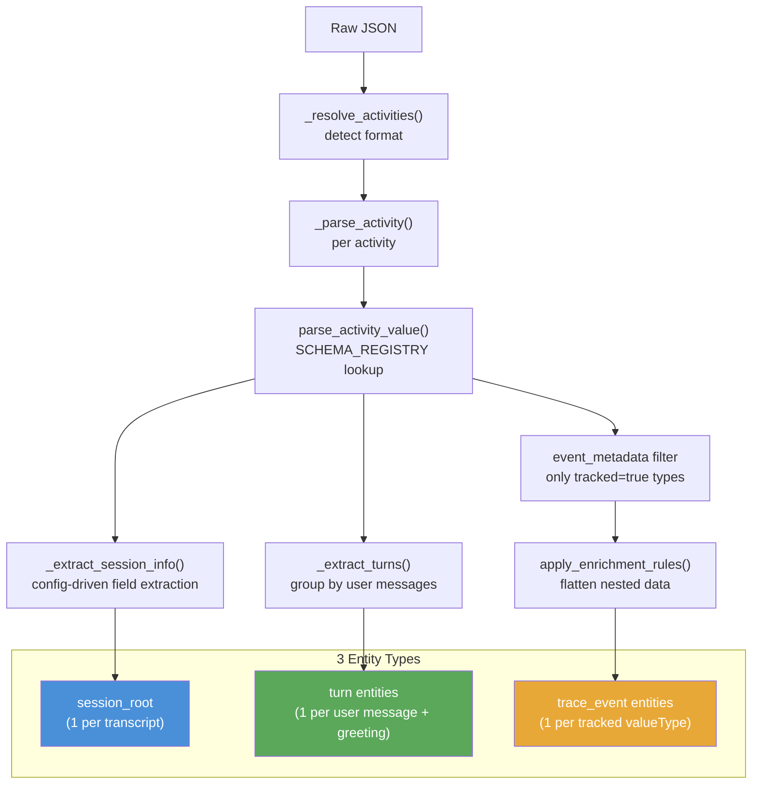

### Turn Grouping

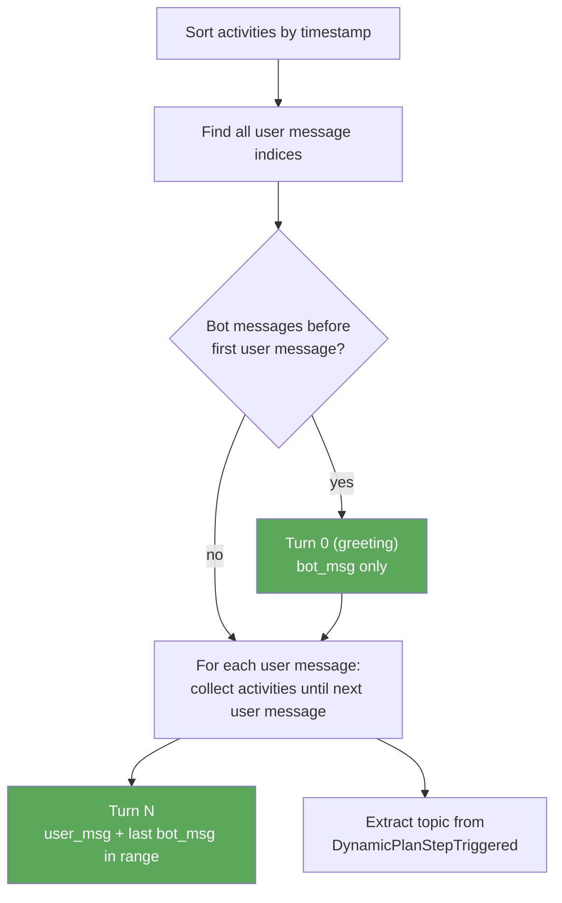

Turn 0 captures the bot's greeting before any user interaction. Subsequent turns are bounded by consecutive user messages — all bot messages and trace events between two user messages belong to the same turn.

### Worked Example: Entities Produced

From the Rex Bluebot transcript (9 activities → 7 entities):

| # | entity_id | entity_type | value_type | Key Properties |
|---|-----------|-------------|------------|----------------|
| 1 | `session_root` | `trace_event` | `SessionInfo` | outcome=Resolved, bot_name=Rex Bluebot, channel=msteams |
| 2 | `turn_0` | `turn` | — | bot_msg="Hello! I'm Rex Bluebot...", is_greeting=true |
| 3 | `turn_1` | `turn` | — | user_msg="What is the refund policy?", bot_msg="Our refund policy..." |
| 4 | `trace_DialogRedirect_0` | `trace_event` | `DialogRedirect` | targetDialogId=topic.RefundPolicy |
| 5 | `trace_DynamicPlanReceived_0` | `trace_event` | `DynamicPlanReceived` | step_count=1, is_final_plan=False |
| 6 | `trace_DynamicPlanStepTriggered_0` | `trace_event` | `DynamicPlanStepTriggered` | taskDialogId=P:UniversalSearchTool, type=KnowledgeSearch |
| 7 | `trace_DynamicPlanFinished_0` | `trace_event` | `DynamicPlanFinished` | was_cancelled=False |

Note: `ConversationInfo` data is absorbed into `session_root` via `session_info_extraction` rather than creating a separate entity. Entity #5 has enriched properties (`step_count`, `is_final_plan`) that were flattened from the nested `value` field during extraction.

### 6.1 Value Models (SCHEMA_REGISTRY)

Each known `valueType` has a Pydantic model in `models.py` that validates and types the raw `value` dict. This catches malformed data early and provides IDE autocomplete.

See: `models.py` lines 38-199

The pattern:

```
Activity with valueType="SessionInfo" →
  SCHEMA_REGISTRY["SessionInfo"] →
    SessionInfoValue model →
      validated, typed dict
```

| valueType | Model Class | Key Fields |
|-----------|-------------|------------|
| `SessionInfo` | `SessionInfoValue` | outcome, type, startTimeUtc, endTimeUtc, turnCount, outcomeReason, impliedSuccess |
| `IntentRecognition` | `IntentRecognitionValue` | intentName, intentId, score, userMessage |
| `ConversationInfo` | `ConversationInfoValue` | isDesignMode, locale |
| `DynamicPlanReceived` | `DynamicPlanReceivedValue` | steps, isFinalPlan, planIdentifier, toolDefinitions |
| `DynamicPlanStepTriggered` | `DynamicPlanStepTriggeredValue` | planIdentifier, stepId, taskDialogId, thought, type |
| `DynamicPlanFinished` | `DynamicPlanFinishedValue` | planId, wasCancelled |
| `DialogRedirect` | `DialogRedirectValue` | targetDialogId, targetDialogName, sourceDialogId |
| `VariableAssignment` | `VariableAssignmentValue` | name, value, type |
| `ErrorTraceData` | `ErrorTraceDataValue` | isUserError, errorCode, errorMessage |
| `UnknownIntent` | `UnknownIntentValue` | userQuery |
| `KnowledgeTraceData` | `KnowledgeTraceDataValue` | completionState, isKnowledgeSearched, citedKnowledgeSources |
| `GPTAnswer` | `GPTAnswerValue` | gptAnswerState |
| `CSATSurveyResponse` | `CSATSurveyResponseValue` | score, comment |
| `PRRSurveyResponse` | `PRRSurveyResponseValue` | response |
| `EscalationRequested` | `EscalationRequestedValue` | escalationRequestType |
| `HandOff` | `HandOffValue` | (extra="allow") |
| `ImpliedSuccess` | `ImpliedSuccessValue` | dialogId |
| `nodeTraceData` | `NodeTraceDataValue` | nodeID, nodeType, startTime, endTime, topicDisplayName |

All models use `ConfigDict(extra="allow")` so unknown fields pass through without error.

---

## 7. Stage 2: Enrichment System

See: `parsers.py` lines 474-669

### Why Enrichment Exists

MCS trace events often bury useful data inside nested structures. A `DynamicPlanStepFinished` event might have search results at `observation.search_result.search_results[0].Name` — three levels deep. Mapping rules can only read flat, top-level properties. Enrichment bridges this gap by extracting, counting, joining, and flattening nested data into simple string properties.

### Enrichment Pipeline

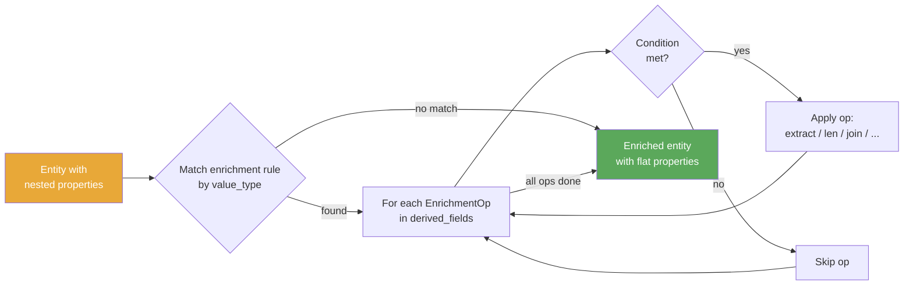

### Condition Types

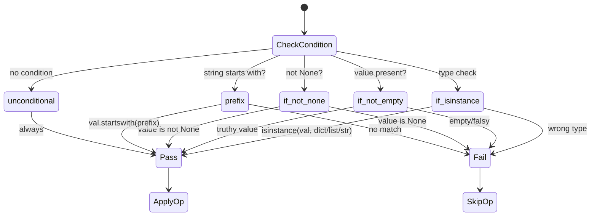

### Enrichment Operations

| Op | What it does | Input example | Output example |
|----|-------------|---------------|----------------|
| `extract_path` | Dot-path traversal into nested dicts | `observation.search_result.search_results` → `[{Name: "Policy.docx"}]` | `"[{'Name': 'Policy.docx'}]"` |
| `len` | Count list items | `steps` → `["P:SearchTool", "P:Topic1"]` | `"2"` |
| `join` | Join list with separator, supports `[*].field` | `actions[*].actionType` → `["Send", "Condition"]` | `"Send, Condition"` |
| `join_unique_sorted` | Dedupe + sort + join | `results[*].Type` → `["SharePoint", "Web", "SharePoint"]` | `"SharePoint, Web"` |
| `json_dump` | Serialize sub-object to JSON string | `observation` → `{content: [...]}` | `'{"content": [...]}'` |
| `str_coerce` | `str(value)` — coerce to string | `isFinalPlan` → `False` | `"False"` |
| `rename` | Copy value under a new key | `dialogSchemaName` → `"schema_v1"` | props[`mcp_dialog_schema`] = `"schema_v1"` |
| `conditional` | Apply only if prefix matches, optional extract | `taskDialogId` = `"MCP:myTool"` with `extract=split_last_colon` | `"myTool"` |

### Worked Example: DynamicPlanReceived Enrichment

Before enrichment:
```
{
  "steps": ["P:UniversalSearchTool"],
  "isFinalPlan": false,
  "planIdentifier": "plan-id-001",
  "timestamp": 1771240863
}
```

Enrichment rule applies 3 ops:
1. `len` on `steps` → `step_count = "1"`
2. `str_coerce` on `isFinalPlan` → `is_final_plan = "False"`
3. `len` on `toolDefinitions` → (null, skipped)

After enrichment:
```
{
  "steps": ["P:UniversalSearchTool"],
  "isFinalPlan": false,
  "planIdentifier": "plan-id-001",
  "timestamp": 1771240863,
  "step_count": "1",
  "is_final_plan": "False"
}
```

The enriched `step_count` and `is_final_plan` properties are now flat strings that mapping rules can directly reference.

---

## 8. Stage 3: Rule Matching + Span Building

See: `converter.py`

### The 5-Phase Algorithm

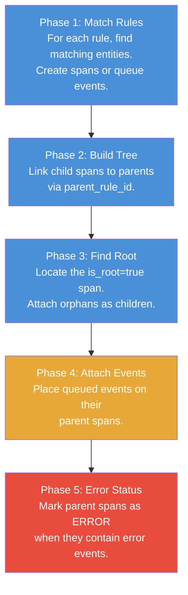

**Phase 1** iterates all 28 rules. For each rule, it finds entities matching `mcs_entity_type` + `mcs_value_type`. Matched entities produce either a span (added to the tree) or a pending event (queued for Phase 4). Span names are built from templates like `"chat turn:{turn_index}"` using entity properties.

**Phase 2** walks rules with a `parent_rule_id`. For each child span, it finds the best parent span (closest by timestamp) from the parent rule's span list and sets `parent_span_id`.

**Phase 3** finds the root span (the one rule with `is_root: true`). Any spans without a parent get adopted as children of the root. Root timing is adjusted to cover all children.

**Phase 4** attaches queued events to their parent spans (or root if no parent specified).

**Phase 5** checks if any error events (names in `error_event_names`) were attached. If so, the parent span gets `status: ERROR`.

### The 28-Rule Tree

This is the complete rule hierarchy from `config/default_mapping.json`. Blue nodes are spans, orange nodes are events.

```mermaid
flowchart TB
    classDef spanNode fill:#4a90d9,color:white,stroke:#2c6faa
    classDef eventNode fill:#e8a838,color:white,stroke:#c4882a
    classDef rootNode fill:#2c6faa,color:white,stroke:#1a4a7a,stroke-width:3px

    SR["session_root<br>invoke_agent {bot_name}<br>CLIENT, root"]:::rootNode

    UT["user_turn<br>chat turn:{N}<br>CLIENT"]:::spanNode
    CSAT["csat_response<br>(event)"]:::eventNode
    PRR["prr_response<br>(event)"]:::eventNode
    IS["implied_success<br>(event)"]:::eventNode
    ESC["escalation<br>(event)"]:::eventNode
    HO["handoff<br>(event)"]:::eventNode

    SR --> UT
    SR --> CSAT
    SR --> PRR
    SR --> IS
    SR --> ESC
    SR --> HO

    KS["knowledge_search<br>knowledge.retrieval<br>CLIENT"]:::spanNode
    DP["dynamic_plan<br>chain plan<br>INTERNAL"]:::spanNode
    TC["topic_classification<br>dialog_redirect<br>INTERNAL"]:::spanNode
    MCI["mcp_server_init<br>create_agent mcp_init<br>INTERNAL"]:::spanNode
    MCT["mcp_tools_list<br>create_agent mcp_tools<br>INTERNAL"]:::spanNode
    DT["dialog_tracing<br>chain dialog_trace<br>INTERNAL"]:::spanNode
    PI["protocol_info<br>chain protocol_info<br>INTERNAL"]:::spanNode
    SI["skill_info<br>create_agent skill_info<br>INTERNAL"]:::spanNode
    AB["ai_builder_trace<br>execute_tool ai_builder<br>INTERNAL"]:::spanNode
    BLK["dynamic_plan_step_blocked<br>blocked_step<br>INTERNAL"]:::spanNode
    KTD["knowledge_trace_data<br>knowledge.trace.data<br>INTERNAL"]:::spanNode
    ET["error_trace<br>(event)"]:::eventNode
    EC["error_code<br>(event)"]:::eventNode
    VA["variable_assignment<br>(event)"]:::eventNode
    UI["unknown_intent<br>(event)"]:::eventNode

    UT --> KS
    UT --> DP
    UT --> TC
    UT --> MCI
    UT --> MCT
    UT --> DT
    UT --> PI
    UT --> SI
    UT --> AB
    UT --> BLK
    UT --> KTD
    UT --> ET
    UT --> EC
    UT --> VA
    UT --> UI

    PSB["plan_step_bind<br>chain bind:{tool}<br>INTERNAL"]:::spanNode
    PSF["plan_step_finished<br>execute_tool {tool}<br>CLIENT"]:::spanNode
    PF["plan_finished<br>chain plan_finished<br>INTERNAL"]:::spanNode
    PST["plan_step_triggered<br>chain step:{tool}<br>INTERNAL"]:::spanNode
    PRD["plan_received_debug<br>chain plan_debug<br>INTERNAL"]:::spanNode

    DP --> PSB
    DP --> PSF
    DP --> PF
    DP --> PST
    DP --> PRD

    MCIC["mcp_server_init_confirmation<br>create_agent mcp_init_confirm<br>INTERNAL"]:::spanNode

    MCI --> MCIC
```

Summary: **19 span rules** + **9 event rules** = **28 total rules**.

| Parent | Child Spans | Child Events |
|--------|-------------|--------------|
| `session_root` | `user_turn` | `csat_response`, `prr_response`, `implied_success`, `escalation`, `handoff` |
| `user_turn` | `knowledge_search`, `dynamic_plan`, `topic_classification`, `mcp_server_init`, `mcp_tools_list`, `dialog_tracing`, `protocol_info`, `skill_info`, `ai_builder_trace`, `dynamic_plan_step_blocked`, `knowledge_trace_data` | `error_trace`, `error_code`, `variable_assignment`, `unknown_intent` |
| `dynamic_plan` | `plan_step_bind`, `plan_step_finished`, `plan_finished`, `plan_step_triggered`, `plan_received_debug` | — |
| `mcp_server_init` | `mcp_server_init_confirmation` | — |

### Single Rule Match Logic

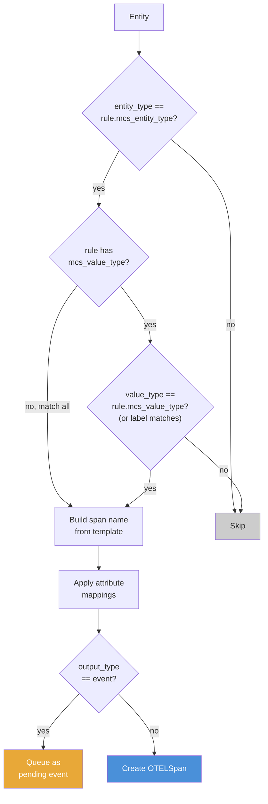

### 8.1 Transform Types

See: `converter.py` lines 54-67

| Transform | What it does | MCS value | transform_value | Output |
|-----------|-------------|-----------|-----------------|--------|
| `direct` | Pass through as-is | `"Resolved"` | — | `"Resolved"` |
| `template` | String substitution | `"What is refund?"` | `[{{"role":"user","content":"{value}"}}]` | `[{"role":"user","content":"What is refund?"}]` |
| `constant` | Ignore input, use fixed value | (any) | `"copilot_studio"` | `"copilot_studio"` |
| `lookup` | Same as direct (reserved for future use) | `"en-US"` | — | `"en-US"` |

---

## 9. Stage 4: OTLP Export

See: `converter.py` lines 330-439

After the span tree is built, `to_otlp_json()` serializes it into the OTLP JSON format:

1. **Flatten** the span tree depth-first into a flat list
2. **Wrap** in `resourceSpans → scopeSpans → spans[]` structure
3. **Convert** each span's attributes to typed OTLP values (`stringValue`, `intValue`, `boolValue`, `doubleValue`)
4. **Serialize** events with their attributes and nanosecond timestamps

### OTLP Output Structure (Worked Example)

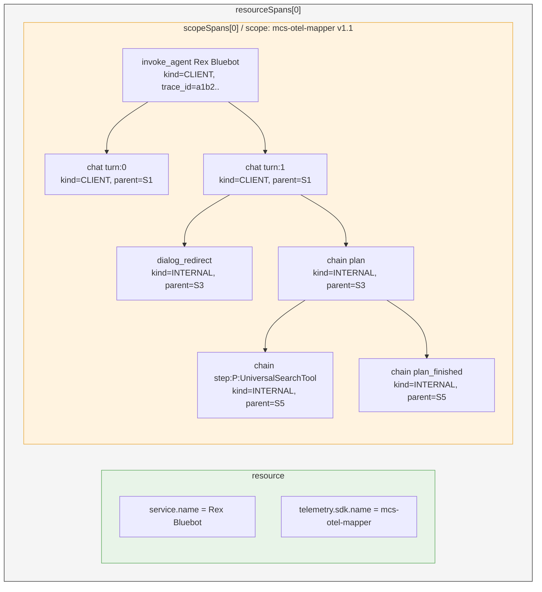

The `service.name` is set to the bot name when available (from `botContent.yml` or the transcript's first bot message), falling back to `"copilot-studio"`.

---

## 10. The Improvement Engine

See: `improve.py`, `analyze_transcripts.py`

The improvement engine is a self-learning loop that analyzes real transcripts to find gaps in the mapping config and iteratively fixes them.

### Improvement Loop

```mermaid
flowchart TB
    Start["Load current<br>default_mapping.json"]
    Analyze["Analyze corpus<br>(all transcripts)"]
    Measure["Measure coverage %<br>and fill rate %"]
    Classify["Classify findings:<br>new_type | new_attribute | new_enrichment"]
    Split{"Auto-fixable?"}
    Auto["Auto-fix:<br>add EventMetadata +<br>SpanMappingRule"]
    Review["Needs review:<br>complex nested types"]
    Check{"Converged?<br>no fixes or < 0.1% gain"}
    Save["Save proposed_mapping.json"]
    Approve["User: review diff<br>then approve"]

    Start --> Analyze --> Measure --> Classify --> Split
    Split -->|">= 3 files| Auto
    Split -->|"< 3 files or nested"| Review
    Auto --> Check
    Review --> Check
    Check -->|no| Analyze
    Check -->|yes| Save --> Approve

    style Start fill:#4a90d9,color:white
    style Auto fill:#5ba85b,color:white
    style Review fill:#e8a838,color:white
    style Save fill:#9b59b6,color:white
```

### Finding Lifecycle

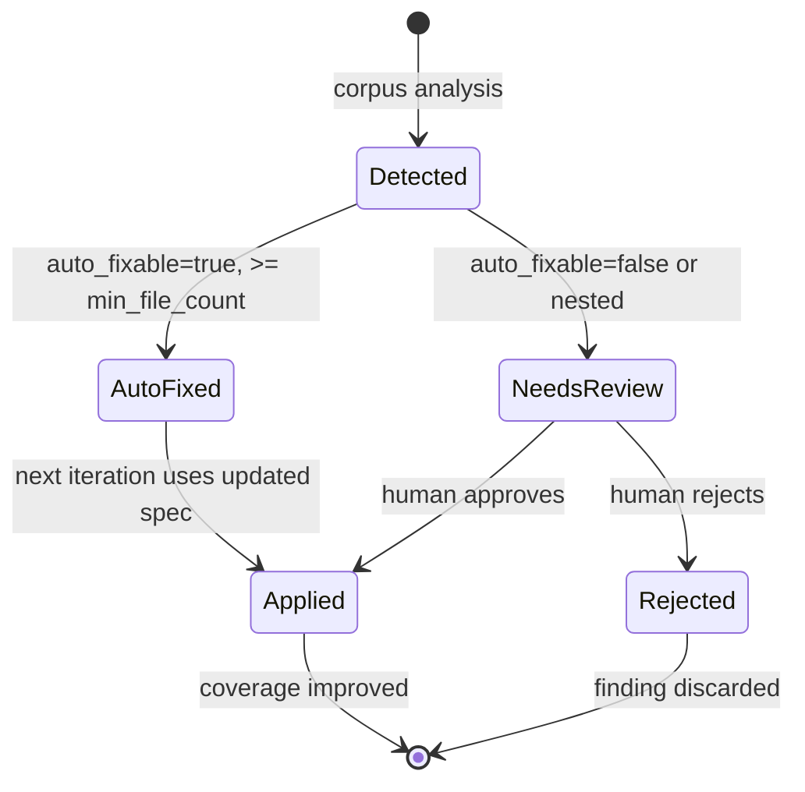

Finding categories:

| Category | Auto-fixable? | What it means |
|----------|---------------|---------------|
| `new_type` | Yes (if >= 3 files) | Unknown valueType found — add EventMetadata + SpanMappingRule |
| `new_attribute` | Yes | Property on a tracked type has no AttributeMapping — add one |
| `new_enrichment` | No | Type has nested structures — needs manual enrichment rules |

The CLI workflow:
1. `uv run python improve.py run /path/to/transcripts/`
2. `uv run python improve.py diff` — see what changed
3. `uv run python improve.py approve` — apply with version bump

---

## 11. The Web UI

See: `web/web.py`, `web/components/`, `web/state/`

The Reflex app provides a visual interface for the full pipeline.

### UI Structure

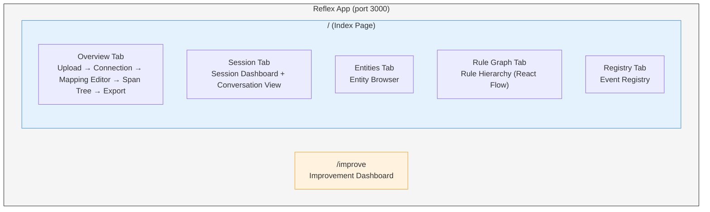

### State Mixins

The app state is composed from 4 mixins that handle different concerns:

| Mixin | File | Manages |
|-------|------|---------|
| `UploadMixin` | `web/state/_upload.py` (224 lines) | File upload, transcript parsing, botContent parsing, entity extraction |
| `MappingMixin` | `web/state/_mapping.py` (794 lines) | Mapping editor state, rule CRUD, React Flow node/edge generation, OTLP export |
| `PreviewMixin` | `web/state/_preview.py` (339 lines) | Span tree rendering, entity browsing, session dashboard data, conversation view |
| `ImproveMixin` | `web/state/_improve.py` (330 lines) | Improvement engine UI, run management, finding review, proposed mapping diff |

These compose into a single `State` class:

```python
class State(UploadMixin, MappingMixin, PreviewMixin, ImproveMixin, rx.State):
    pass
```

---

## 12. Source File Reference

### Core Pipeline

| File | Lines | Role |
|------|-------|------|
| `models.py` | 354 | All Pydantic models: MCS input types, OTEL output types, mapping specification |
| `parsers.py` | 727 | Transcript parsing, entity extraction, enrichment ops, turn grouping, botContent parsing |
| `converter.py` | 439 | 5-phase rule matching, span tree building, OTLP JSON serialization |
| `config_loader.py` | 91 | Load and validate `config/default_mapping.json` into `MappingSpecification` |
| `config/default_mapping.json` | 2163 | Single source of truth: 27 event types, 16 enrichment rules, 28 mapping rules |
| `otel_registry.py` | 32 | OTEL attribute definitions (the output vocabulary) |
| `log.py` | 10 | Loguru logger setup |
| `utils.py` | 8 | Utility functions (`to_snake_case`) |

### Improvement Engine

| File | Lines | Role |
|------|-------|------|
| `analyze_transcripts.py` | 521 | Corpus analysis, coverage measurement, gap detection, report generation |
| `improve.py` | 876 | Self-learning loop, finding classification, auto-fix, diff, approve CLI |

### Web UI

| File | Lines | Role |
|------|-------|------|
| `main.py` | 1 | Reflex app entry point |
| `rxconfig.py` | 21 | Reflex configuration |
| `web/web.py` | 95 | Page layout, tab structure, routing |
| `web/state/__init__.py` | 12 | State composition from 4 mixins |
| `web/state/_upload.py` | 224 | Upload handling, parsing, entity extraction |
| `web/state/_mapping.py` | 794 | Mapping editor, React Flow, OTLP export |
| `web/state/_preview.py` | 339 | Span tree, entity browser, session dashboard |
| `web/state/_improve.py` | 330 | Improvement engine dashboard |
| `web/components/` | ~2,600 | 12 UI component files (upload, mapping editor, span tree, etc.) |

### Tests

| File | Role |
|------|------|
| `tests/fixtures/rex_teams_transcript.json` | Simple 1-turn Teams transcript (used in worked examples) |
| `tests/fixtures/pva_studio_transcript.json` | Multi-turn Studio transcript |
| `tests/fixtures/zava_expense_transcript.json` | Complex expense-reporting transcript |
| `tests/fixtures/zava_bot_content.yml` | Sample botContent.yml metadata |
| `tests/fixtures/sample_dataverse.csv` | Dataverse CSV export format |

---

## Glossary

| Term | Meaning |
|------|---------|
| **Activity** | A single event in a Copilot Studio transcript (message, trace, or event) |
| **Attribute** | A key-value pair on an OTEL span (e.g., `mcs.session.outcome: "Resolved"`) |
| **Copilot Studio** | Microsoft's platform for building AI chatbots (formerly Power Virtual Agents) |
| **Dataverse** | Microsoft's data platform where Copilot Studio stores conversation transcripts |
| **Enrichment** | Flattening nested JSON structures into simple key-value properties for mapping |
| **Entity** | A normalized version of a transcript activity, ready for rule matching |
| **Event (OTEL)** | A point-in-time annotation on a span (no duration), used for errors and variable changes |
| **Mapping rule** | Instructions for converting one type of MCS entity into an OTEL span or event |
| **MCP** | Model Context Protocol — a standard for connecting AI agents to external tools |
| **OTEL** | OpenTelemetry — an open standard for collecting observability data |
| **OTLP** | OpenTelemetry Protocol — the JSON wire format for sending trace data to collectors |
| **Span** | A unit of work in a trace, with name, timing, attributes, and parent-child relationships |
| **Trace** | A tree of spans representing an entire conversation session |
| **Transcript** | The raw conversation log exported from Copilot Studio |
| **Turn** | One user message + the bot's response (a back-and-forth exchange) |
| **valueType** | The identifier for what kind of trace event an activity represents |
